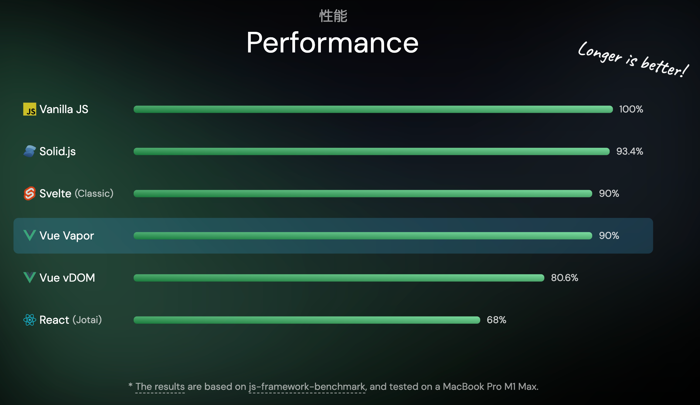
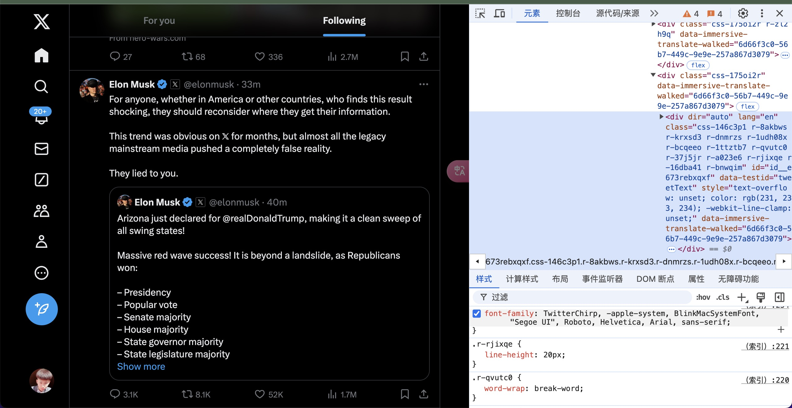

# 🚚 Web Weekly 

## 🍵 Small talk
### 1）🔁 Vue Vopar -- (2024)年底发布alpha版本（2023年中旬建库）

「**摘要**」 Vapor Mode是Vue.js的一种编译策略，可以提高Vue.js应用的性能。~~通过Vue Vapor SFC Playground和Vue Volar Template Explorer可以体验和探究Vapor Mode。开启Vapor Mode的方法是升级vue和@vitejs/plugin-vue的版本，并将createApp改为createVaporApp。Vapor Mode的编译产物特点包括模板编译、渲染效果和文本设置。Vapor Mode优化了性能和API使用。总体来说，Vapor Mode为Vue生态系统带来了前所未有的变革，为开发者提供更高效的开发体验。~~

请看VCR⬇️
[Vapor Mode](./vue-vopar/vue-vopar.html)是 Vue.js没有虚拟 DOM的一种编译策略。



### 1）🔂 补充 - [svelte](./svelte/index.html)
> 在线查看 svelte 编译后的结果和 react 编译后的结果（用Bun编译）

### 1）⏪ 补充 - React  RSC， HTMX

**结论**：我们在朝向前后端冗余合并的状态出发。

RSC（人话）：既要服务端渲染，又要处理数据
[HTMX](https://segmentfault.com/a/1190000044287819)： 后端主导的框架，不用写JS并且可以请求的HTML（通过编译实现）；类似👇这样
```htm
<button 
  hx-post="/data"
  hx-trigger="click"
  hx-target="#parent-div"
  hx-swap="outerHTML"
>
    点我请求data
</button>


```

### 2）🇨🇳 ArkTS (纯血鸿蒙)
是华为为鸿蒙系统开发的声明式编程语言，它基于 TypeScript 构建，并扩展了特定于鸿蒙平台的特性。ArkTS 提供了简洁的语法和丰富的功能，使得开发者可以以更高效的方式开发鸿蒙应用。

简单的Demo代码

```ts
// Index.ets
import { Entry, Component } from '@ohos.arkui.arkui';
import { Text } from '@ohos.arkui.arkui';
@Entry
@Component
struct Index {
  @State message: string = 'Hello World';
  build() {
    Column() {
        Text(this.message)
            .fontSize(24)
            .margin(10)
            .width('100%')
            .height('100%');
    }
  }
}
```

### 3）👎🏿 CommonJS 和 ES Module 终于要互相兼容了？？？
大家在coding过程中。
[先问问大家几个问题-链接原文](https://juejin.cn/post/6844903520865386510#heading-1)：

- 为何有的地方使用 require 去引用一个模块时需要加上 default？ require('xx').default
- 经常在各大UI组件引用的文档上会看到说明 import { button } from 'xx-ui' 这样会引入所有组件内容，需要添加额外的 babel 配置，比如 babel-plugin-component？
- 为什么可以使用 es6 的 import 去引用 commonjs 规范定义的模块，或者反过来也可以又是为什么？
- 我们在浏览一些 npm 下载下来的 UI 组件模块时（比如说 element-ui 的 lib 文件下），看到的都是 webpack 编译好的 js 文件，可以使用 import 或 require 再去引用。但是我们平时编译好的 js 是无法再被其他模块 import 的，这是为什么？
- babel 在模块化的场景中充当了什么角色？以及 webpack ？哪个启到了关键作用？
- 听说 es6 还有 tree-shaking 功能，怎么才能使用这个功能？[链接-tree-shaking](https://www.webpackjs.com/guides/tree-shaking/)
  
**common.js 和 es6 中模块引入的区别?**
- 1、CommonJS 模块输出的是一个值的拷贝，ES6 模块输出的是值的引用。

- 2、CommonJS 模块是运行时加载，ES6 模块是编译时输出接口。

- 3、CommonJs 是单个值导出，ES6 Module可以导出多个

- 4、CommonJs 是动态语法可以写在判断里，ES6 Module 静态语法只能写在顶层

- 5、CommonJs 的 this 是当前模块，ES6 Module的 this 是 undefined

本质的原因：**在服务器环境中，同步加载通常不是问题，因为文件大都在本地。然而，在浏览器环境中，同步加载可能会导致性能问题，因为它会阻塞浏览器的事件循环，直到脚本完全下载和解析。**

[CommonJS 和 ES Module](./CommonJS%20和%20ES%20Module%20终于要互相兼容了？？？.htm)

现实中例子的应用： 我们服务端渲染项目

<p style="color:red;font-weight:600">在Deno，Bun中模块混合已经得到解决。</p>

### 4）🏇 Js 运行时
- Nodejs
- [Deno 2.0](https://www.sohu.com/a/817690621_121798711) 引领前端包管理新纪元
- Bun

Nodejs开发过程中的瓶颈可以说的非常的多哈。因为现代话技术，rust，go，web融合在一块的网络，依赖管理，生产运行，单线程的压力，尽管尽管有了多线程的支持。
牛逼在老，生态高，像是php的替代品一样。


Deno 是nodejs原作者重构的新进步，对Nodejs的安全性（关于文件系统的访问，网络，环境变量）这是由沙箱环境创造的，第二点也是我们前面提过的 JS规范的改正（ES，与CommonJs）。包括直接网络引用依赖，总结一句话，把现代的WEB与新款的Node合并优点。所以形成了优势，但是引擎的使用是一样的（V8）。而弊端就是生态。
你可以像这样运行`deno run https://docs.deno.com/examples/hello-world.ts`
  - 原生支持太多现代化的东西了，例如jsx [main](./runtime/deno/main.tsx)
  - hono实现的直接支持的jsx返回[hono](./runtime/deno/hono/main.tsx) *hono 是类似 koa，express的tiny库*

[Bun](https://bun.sh/)~~点进去看看下官网介绍，性能差异~~，我觉得这东西连蒙带猜，也能写出来几个demo。
  - [react.tsx](./runtime/bun/react.tsx) -- bun run react.tsx
  - [server.tsx](./runtime/bun/server.tsx) -- bun run server.tsx

官网的Bun给的信息是：
-  **一体化的工具**（**运行、构建、测试和调试，以及从单个文件到全栈应用的 JS 和 TS 项目**）
-  自己有自己的包管理（Bunx）
-  自己给自己打包
-  等等等等


**现代**关键字梳理：
- EsM 与 Common混合
- Promise
- Ts(x)原生支持
- 依赖包的管理
- 热重载
- 打包工具
- 社区
- WebAPi （WASM，Fetch，Canvas，）
- 引擎选择
- 多线程
- 生态圈
- 静态检查与动态编译（RUST）
- 等等


Deno基于沙盒环境，并且支持各种现代的技术能力，明显具备云能力(虚拟，隔离，自动，扩展，安全跨平台的兼容性，网络)。（类似golang）
Bun在云支持方面明显做的不足。


如今的我们在使用express.js可以很快就搭建起运行API。
但是，目前最具挑战性的部分是选择合适的 **JavaScript** 引擎（下一个话题）。

### 5） ⚙️ 引擎
- [JS 引擎](https://cloud.tencent.com/developer/article/1801742)
> 在 JS 引擎方面，Hermes 确实很火——我们看到Static Hermes模糊了原生代码和 JS 之间的界限，即将推出的稳定ABI和 ES6 支持将让它变得更加灵活。然而，一些难以解决的平台问题依然存在，比如支持Intl，以及Date的速度很慢。但即使克服了这些问题，它也需要保持警惕，因为QuickJS项目已经在复苏，事实证明它在调用 C 函数方面比调用 JS 函数更快! 与此同时，Shadow 已经启动了自己的 JS 引擎Porffor，值得我们关注。
- 浏览器引擎
> 在浏览器引擎方面，新的Ladybird浏览器已经吸引到31万美元的投资，并且找来Andrew Kaster和Alexander Kalenik做全职开发。Servo Web 渲染器已经享受了一年的Igalia工程支持。还出现了一个全新的独立浏览器引擎Shadow，居然是用 JS 编写的！看来，构建一个新的 Web 浏览器似乎并不是那么不可能的事情。
- 运行时引擎
    - nodejs -  使用的是Google Chrome的JavaScript V8引擎。
    - Bun：使用的是JavaScriptCore引擎，该引擎驱动WebKit浏览器
    - Deno：使用的也是V8引擎，与Node.js相同。


### 6) 💻 跨平台框架
跨平台框架多多少少会出入在我们的视线中，超一线的大厂也在循序渐进的改用Fultter架构。
但是。在全球市场上⬇️⬇️
据透露，今年 React Native 相关的工作岗位数量是 Flutter 的6倍，而且Hixie和Tim Sneath都离开了谷歌，Tim 甚至在宣传SwiftUI。Flutter 开发者陷入了一种生存危机，被谷歌杀死的梦魇前所未有地逼近。

与此同时，React Native 的势头并没有显示出任何放缓的迹象，亚马逊宣布它已成为他们多个旗舰应用程序的首选技术。开发者体验得到了大幅改善，Software Mansion 展示了他们的新IDE，Meta 从 Flipper 迁移到了Chrome Devtools。Expo 也做了很多值得一提的事情，特别是通过Expo Modules革命性地提升了原生 API 访问能力，以及继续进行代码共享和延续 SSR 与Expo Router的故事。Meta和微软朝着 Web 一致性迈进，从DOM遍历到事件循环，都非常令人兴奋

其他框架也在采取行动，**Tauri** 与Servo合作，Dioxus承诺使用 **Rust** 构建 GUI 应用，并提供类似 React 的开发体验。它基于Taffy布局引擎，Taffy 是 Yoga 的一个非常有前途的后继者，可能很快就会提供C绑定，可以在更多的场景中使用。我还听到了不断有关 Kotlin Multiplatform 的讨论，尽管没有特别值得一提的内容。但我个人觉得Tauri在桌面端的支持并不友好。

跨平台开发将成为未来软件开发的主流趋势，框架和工具如React Native、Flutter和Electron等将得到广泛应用。此外，预计2024年将看到更多的技术创新，包括边缘计算的崛起、可持续性编程、AR和VR技术的进一步融合、量子计算的发展以及智能合约和区块链技术的扩展应用。

---------

以及哪里的风都能被Js吹到的**NativeScript** (包括苹果的[visionPro](https://docs.nativescript.cn/guide/visionos))
> Tip: 你可以在google商店下载 `NativeScript Preview`, 然后[打来这个项目](https://stackblitz.com/edit/nativescript-music-player-transition-example-tsp64d?file=app%2Fmain-view.xml)等待右侧出现二维码，登录后，手机在刚刚下载好的软件上就可以查看APP内容了。

**原理**：很像是webview，但其实不是webview，就使用**原生平台的渲染引擎**来绘制UI组件，这意味着在iOS上使用UIKit，在Android上使用Android SDK，从而保证了UI的原生性能和外观
去尝试你想尝试的吧。

### 7） ✈️ 构建系统
说到构建系统，我们看到了越来越多的下一代构建工具，如 SWC 和 Esbuild，还有更多与它们相配套的捆绑工具。Rome 垮台，Biome崛起。Turbopack去年宣称自己是 Webpack 的继任者，但今年Rspack挥舞着诉状冲进法庭。与此同时，Metro 仍然是 React Native 的首选武器。


### 8） 🪫 新的样式解决方案和组件库将持续涌现（开放话题）
**css-in-js**
你可能会问，它们与"CSS 预处理器"（比如 Less 和 Sass，包括 PostCSS）有什么区别？回答是 CSS in JS 使用 JavaScript 的语法，是 JavaScript 脚本的一部分，不用从头学习一套专用的 API，也不会多一道编译步骤。

`pandaCss`、`unocss`、`tailwindcss`等，几乎几十种

**unocss 写法如下**

```jsx
<div class="inline-block h-164 bg-#F2F3F5 rounded-4 p-20 pt-16!">
  <div class="mb-8 text-14 text-#7A8699">示例（请按照示例上传真实、有效的集装箱照片）：</div>
  <div class="f-s">
    <div class="relative w-100 h-100 mr-8 last-mr-0" v-for="item in sampleBoxPics" :key="item.id">
      
      <div class="absolute bottom-0 w-full f-c bg-#1D2129/80 text-white text-12">{{ item.name }}</div>
    </div>
  </div>
</div>
```

加上 tailwindcss

```jsx
<main class="py-6 px-4 sm:p-6 md:py-10 md:px-8">
  <div class="max-w-4xl mx-auto grid grid-cols-1 lg:max-w-5xl lg:gap-x-20 lg:grid-cols-2">
    <div class="relative p-3 col-start-1 row-start-1 flex flex-col-reverse rounded-lg bg-gradient-to-t from-black/75 via-black/0 sm:bg-none sm:row-start-2 sm:p-0 lg:row-start-1">
      <h1 class="mt-1 text-lg font-semibold text-white sm:text-slate-900 md:text-2xl dark:sm:text-white">Beach House in Collingwood</h1>
      <p class="text-sm leading-4 font-medium text-white sm:text-slate-500 dark:sm:text-slate-400">Entire house</p>
    </div>
    <div class="grid gap-4 col-start-1 col-end-3 row-start-1 sm:mb-6 sm:grid-cols-4 lg:gap-6 lg:col-start-2 lg:row-end-6 lg:row-span-6 lg:mb-0">
      
      
      
    </div>
    <dl class="mt-4 text-xs font-medium flex items-center row-start-2 sm:mt-1 sm:row-start-3 md:mt-2.5 lg:row-start-2">
      <dt class="sr-only">Reviews</dt>
      <dd class="text-indigo-600 flex items-center dark:text-indigo-400">
        <svg width="24" height="24" fill="none" aria-hidden="true" class="mr-1 stroke-current dark:stroke-indigo-500">
          <path d="m12 5 2 5h5l-4 4 2.103 5L12 16l-5.103 3L9 14l-4-4h5l2-5Z"  stroke-width="2" stroke-linecap="round" stroke-linejoin="round" />
        </svg>
        <span>4.89 <span class="text-slate-400 font-normal">(128)</span></span>
      </dd>
      <dt class="sr-only">Location</dt>
      <dd class="flex items-center">
        <svg width="2" height="2" aria-hidden="true" fill="currentColor" class="mx-3 text-slate-300">
          <circle cx="1" cy="1" r="1" />
        </svg>
        <svg width="24" height="24" fill="none" stroke="currentColor" stroke-width="2" stroke-linecap="round" stroke-linejoin="round" class="mr-1 text-slate-400 dark:text-slate-500" aria-hidden="true">
          <path d="M18 11.034C18 14.897 12 19 12 19s-6-4.103-6-7.966C6 7.655 8.819 5 12 5s6 2.655 6 6.034Z" />
          <path d="M14 11a2 2 0 1 1-4 0 2 2 0 0 1 4 0Z" />
        </svg>
        Collingwood, Ontario
      </dd>
    </dl>
    <div class="mt-4 col-start-1 row-start-3 self-center sm:mt-0 sm:col-start-2 sm:row-start-2 sm:row-span-2 lg:mt-6 lg:col-start-1 lg:row-start-3 lg:row-end-4">
      <button type="button" class="bg-indigo-600 text-white text-sm leading-6 font-medium py-2 px-3 rounded-lg">Check availability</button>
    </div>
    <p class="mt-4 text-sm leading-6 col-start-1 sm:col-span-2 lg:mt-6 lg:row-start-4 lg:col-span-1 dark:text-slate-400">
      This sunny and spacious room is for those traveling light and looking for a comfy and cosy place to lay their head for a night or two. This beach house sits in a vibrant neighborhood littered with cafes, pubs, restaurants and supermarkets and is close to all the major attractions such as Edinburgh Castle and Arthur's Seat.
    </p>
  </div>
</main>

```
twitter

facebook 


### 9） 🪧 其他
其实还有很多东西值得去了解，了解之后你就会知道瞎折腾也挺有意思的，那些理论先行和实践先出的技术，产物，也许会有一部分卷入技术革命的浪潮。
关于其他的关键词：
- Rust提升nodejs性能瓶颈
- 数字技术（虚拟技术）
- 还有那不可逃避的AI技术
- OpenGl领域
- 就说这些吧...


## 🔭 观点（均为个人观点）

如今的WEB已经笼罩了大片可视区域。

### 1) 🔬 关于 Web-Component

之前对这东西的了解太浅显了。

跨平台，永远围绕在发展趋势中，因为JS设计的领域永远在迭代。

我们管React、Vue、Sevlte这些JS编写出来的库叫什么？
Vue -> 渐进式框架
React -> React is the library for web and native **user interfaces**. Web的UI库

甭管这些理论先行的道理，我们用 这些JS编写出来的产物大多数提供的是UI层面上的便携，后面各自推出了一站式的数据管理模式。

先后提出的大前端，微前端，以及以拼图🧩UI为口号的低代码，但不管怎样，大部分还是站在巨人的肩膀上做产研。
大前端做大前端的框架，微前端出现又做微前端的框架，低代码又有低代码的方案，以及原生，H5，微信小程序等等不同平台为适配不同业务又每每重新研发的产物。

那我为什么觉得web compoent值得关注呢？ 

前端的搭配无非JS、css、html，多半部分在跨越平台的基础上已经有了巨人在做转换代码适配操作了，但依旧是通过HTML编译过去的。而浏览器提出的方案就在原HTML中的实践。

我觉得
我认为
------

web compoents 是由jq -> angluar -> react(or Vue) 从概念到标准的时代进步。
```js
function Light (el, color) {
  this.el = el;
  this.color = color;
}
Light.prototype = {
  render: function () {
    this.el.css({
      background: this.color
    })
  }
};

var redLight = new Light($('.div1'), 'red');
var yellowLight = new Light($('.div2'), 'yellow');
var greenLight = new Light($('.div3'), 'green');

var ins = [redLight, yellowLight, greenLight];

ins.forEach(function (item) {
  item.render();
});
```
------

进步到**抽象**，我记得当时还是在使用 webstorm， 还是 win的Notepad++

angular -> 面向对象后的数据与渲染分离(数据的**双向绑定**「这个应该很多人知道吧，单项工作流，双向数据，双倍数据，n倍的麻烦」)

```tsx
var app = angular.module('lightApp', []);

app.controller('LightCtrl', function ($scope) {
  $scope.lights = ['red', 'yellow', 'green'];

  $scope.add = function () {
    $scope.lights.push('blue');
  };
});

angular.bootstrap($('#ng-container')[0], ['lightApp']);

// html
<div ng-controller="LightCtrl">
    <button ng-click="add()">add</button>
    <div class="container">container<div ng-repeat="light in lights track by $index" style="background: {{light}}">{{light}}</div>
    </div>
</div>
```

------
在到React -> 更高级的抽象 （**现在艺术**）

```jsx
var Light = React.createClass({
  render: function () {
    var color = this.props.color;
    var styleObj = {backgroundColor: color};
    return <div style={styleObj}>{color}</div>;
  }
});

React.render((
  <div>
    <Light color='red' />
    <Light color='yellow' />
    <Light color='green' />
  </div>
), document.getElementById('main'));
```


最后关于 Google 写的 [Lit](https://lit.dev/docs/components/overview/)

### 2）😶‍🌫️ 前端、后端和全栈开发之间的界限将越来越模糊  
距离我们最近的是nodejs，而更近的是为了做SEO或者SGO加速优化的Nuxt与Next技术（即服务端渲染技术）。
服务器端渲染（SSR）和静态网站生成（SSG）框架因SEO和性能优势而备受关注，
在next中可以操作数据库

### 3）♿️ 无障碍性
我上次在翻MDN时候突然关注到了一个笑的变化， 在Guides中出现了[无障碍](https://developer.mozilla.org/zh-CN/docs/Web/Accessibility)

目前有 超过 10 亿人 患有这样或那样的残疾，因此在开发过程中，针对无障碍性的设计不能只是事后才想到的问题。以下是关注无障碍性带来的一些好处：
1. **使受众范围更广**：无障碍网站可供各种残疾人士使用，从而大大扩展了其潜在的受众范围。
2. **增强 SEO**：许多针对无障碍性的实践可以增强 SEO，使其内容排名更靠前，更容易被找到。
3. **有利于合法合规**：许多地区的法律都要求网站具有无障碍性，因此创建无障碍性网站有助于避免触犯法律和招致罚款。
4. **增强用户体验**：针对无障碍性功能的设计，通常能改善所有用户的整体体验，而不仅仅是残疾用户。
5. **积极的品牌形象**：对无障碍性的承诺体现了社会责任感和包容性，可以对组织的声誉产生积极影响。


以上。
谢谢!