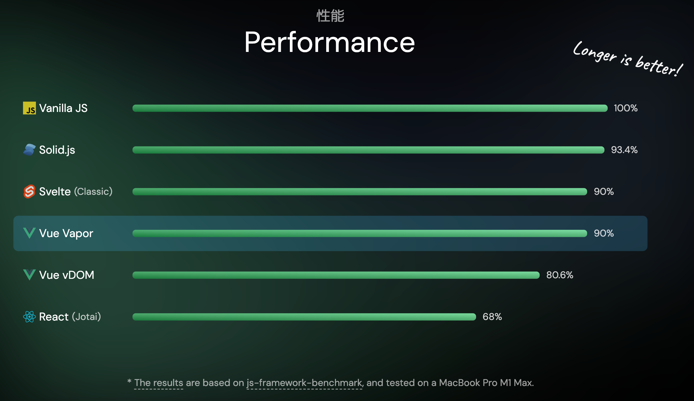
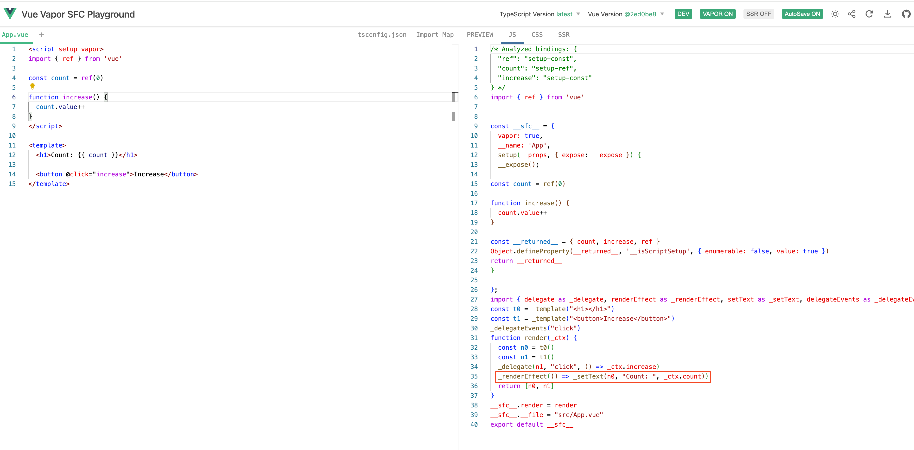

# Vue-Vopar

- 这是啥？
- 为啥出现？

可以接着回看这张图



**没有虚拟DOM**、**高性能**、**更小的包体积**。

**没有虚拟DOM**：意思很简单，就是在Vue Vapor中已经将虚拟DOM给干掉了。

**高性能**：因为干掉了虚拟DOM，瓶颈得以突破，所以性能相对提高了很多。


```js
// Initialize
const container = document.createElement('div')
const label = document.createElement('h1')
const button = document.createElement('button')
button.textContent = 'Increase'

button.addEventListener('click', increase)
let count = 0
const render = () => {
  label.textContent = `Count: ${count}`
}
function increase() {
  count++
  render() // Re-render
}
render() // Initial render

document.body.append(container)
container.append(label, button)

```


##### 通过VUE合理化之后

```js
import { effect, ref } from '@vue/reactivity'

// Initialize
const container = document.createElement('div')
const label = document.createElement('h1')
const button = document.createElement('button')
button.textContent = 'Increase'

button.addEventListener('click', increase)
const count = ref(0)
effect(() => {
  label.textContent = `Count: ${count.value}`
})
function increase() {
  count.value++
}

document.body.append(container)
container.append(label, button)


```
这个是上面的例子在Vue Vapor SFC Playground上面经过编译后的js代码，如下图：



[mini-effect: 也可以简单看看Effect的实现](./mini-effect.html)