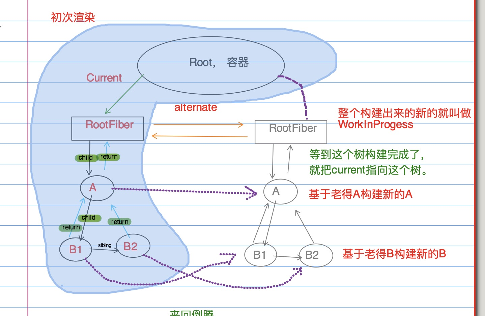
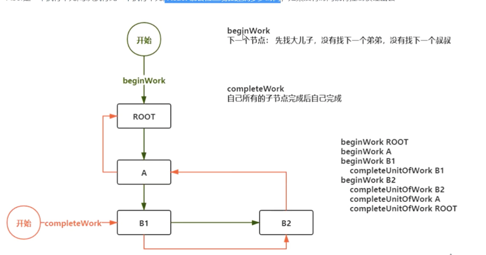
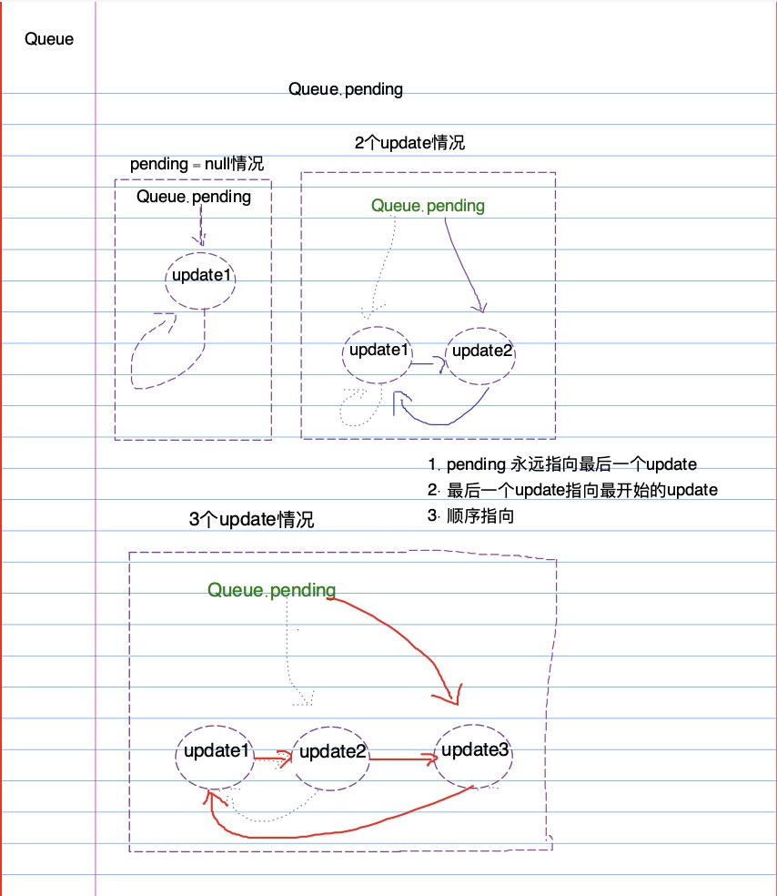

### React-Hooks (1)
> 1. react使用版本（17的最初版本17.0.2）、hooks前四章的讲解、把之前的工作流、mount、update带入到hooks的实现，并且会把useReducer完整实现
> 2. 项目要使用react-scripts启动（**vite的工作方式导致没办法直接断点到 Call Stack**），因为没安装java的jdk，就打包不了源码也就映射不出来sourceMap，就看不了flow的代码了，直接从node_modules的react映射了。
> 3. 随时打断我，一起沟通、学习。


#### 大纲

1. [x] <a href="#PreKnowledge">知识回顾</a>
2. [x] <a href="#Hooks">Hooks 理念</a>
3. [x] [简单的 Hooks 实现](doc/mini-hook.md)
4. [x] Hooks 的数据结构
5. [x] useState 于 useReducer
6. [ ] useEffect
7. [ ] useRef
8. [ ] useMemo 与 useCallback


#### <p id="PreKnowledge">知识回顾</p>
  - 位操作
  - Fiber 
  - 循环链表
------
1. 位操作

    - <u style='color:red'>&</u>：两个输入数**同一比特位**都为 1 才为 1，反之为 0
      ```js
      // b = binary; number.toString(radix=2~36进制)
      const P_0 = 0b10;
      const P_1 = 0b01;
      console.log(P_0 & P_1); // 0b00

      /** ------------------------- */

      // 0&0=0;
      // 0&1=0;
      // 1&0=0;
      // 1&1=1;
      ```
    - <u style='color:red'>|</u>:两个输入数**同一比特位** 只要有一个数为 1 那就是 1
      ```js
      const X_0 = 0b10;
      const X_1 = 0b01;
      console.log(X_0 | X_1); // 0b11

      /** ------------------------- */

      // 0|0=0;
      // 0|1=1;
      // 1|0=1;
      // 1|1=1;
      ```

    - [位操作](source_react-17.0.0/packages/react-reconciler/src/ReactHookEffectTags.js)
        ```js
        // 源码定义：
        // 0b... 二进制； 0xa... 十六进制
        const NoFlags = 0b000; // 0
        const HasEffect = 0b001; // 1
        const Layout = 0b010; // 2 React.useLayoutEffect
        const Passive = 0b100; // 4 React.useEffect

        const layoutTag = HasEffect | Layout; // 0b011
        if (layoutTag & (Layout !== NoFlags)) {
          // 0b010
          console.log("useLayoutEffect");
        }

        const tag = HasEffect | Passive;
        if (tag & (Passive !== NoFlags)) {
          console.log("useEffect");
        }
        ```

2. Fiber
   <!-- alternate:交替，候补 -->
   fiber 树结构的表示：
    ```jsx
    let virtualDom = (
      <div key="A">
        <div key="B1">B1</div>
        <div key="B2">B2</div>
      </div>
    );
    ```

    [*fiber 树双缓存*](https://react.iamkasong.com/process/doubleBuffer.html#%E5%8F%8C%E7%BC%93%E5%AD%98fiber%E6%A0%91)
    <details>

      <summary>fiber（图示）</summary>
      
      

    </details>
    
    *****
    `好，我们看过基本的树结构，再看下 fiber 的执行单元。`
    *****
  

    <details>
      <summary>fiber执行单元（图示）</summary>
      
      
    </details>


3. 循环链表([代码](./src/record/queue.js))

    <details>
      <summary>可以看下图示（在xournal++中操作）</summary>

    
    </details>


#### <p id="Hooks">Hooks 理念</p>

Hook 是 React 16.8 的新增特性。它可以让你在不编写 class 的情况下使用 state 以及其他的 React 特性。

<details>
  <summary>考虑一下怎么出现的？</summary>
  
  *个人见解*
  1. **函数组件出现**,状态内部作用域内管理（猴子最终下了地，为了提高生产力）
  2. 宣扬函数组件的简洁与轻便（复用、嵌套地狱）

> class 组件能做到吗，能，为啥不用，他复杂，看起来就多，那么有人说了，我用 hoc 一样，hoc 本质也是函数包裹，这不就间接同意了函数组件的立场，我可不可以理解推崇函数组件呢？函数在现阶段提出来的理念叫“原子”（**参考**网站的介绍），认为 component 一类（class,func,frag）为 react 世界中的原子，那么原子不同元素是不是由质子的不同数量来组成的呢？当然，后续发现以更小粒子的质子、电子、中子等成为了原子的构成部分。抽象到 React 运行中，hook 显著扮演的角色为更小粒子。

</details>

---

#### [简单的 Hooks 实现](doc/mini-hook.md)

  - 实现基本工作流
  - mount、update的实现
------

`直接去src打断点调试，useReducer`


#### 参考

1. [教程原链接](https://react.iamkasong.com/hooks/prepare.html#%E4%BB%8Elogo%E8%81%8A%E8%B5%B7)
2. [位运算算法](https://juejin.cn/post/6911870195719995406)
