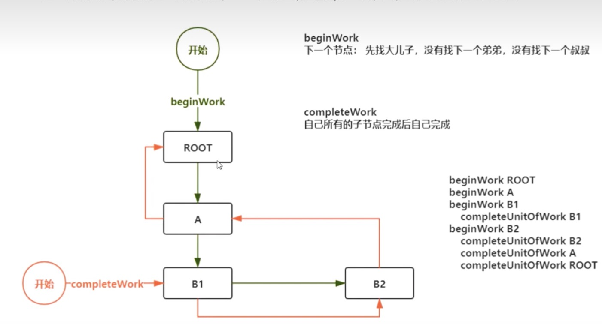
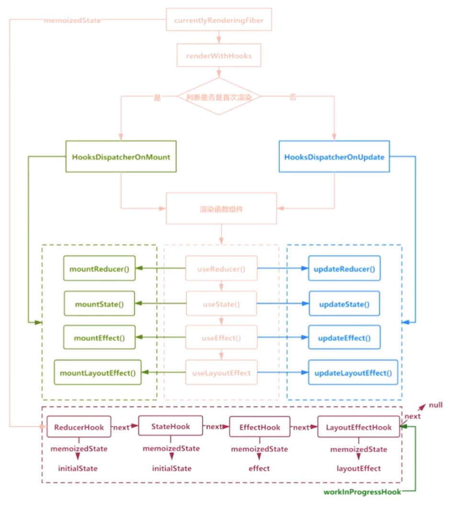

## 实现Hook

初始化：⬇️
先去`src/record/App.js`中打个debugger，在控制台的源代码中的call stack可以看到具体的工作流，可以先从`renderRootSync`开始向上推进，react由于在此版本是深度优先遍历，会进入工作循环区`workLoopsync`
。在这里我代码也有简单的实现，可以参考`src/record/ReactFiberWorkLoop.js`文件，继续向上推进，默认不知道组件的类型走入了`IndeterminateComponent`的函数`mountIndeterminateComponent`调用,里面会进行hook的初始化，之后构建每一层的beginWork,接下来，子节点，完成后回溯，找兄弟节点，回溯到父节点，依次类推。最后知道没有子节点走了`completeUnitOfWork`


**代码中对于初始化流程redenrRoot -> workLoop -> mountIndeterminateComponent -> renderWithHooks -> usereducer 的简单实现**


#### 实现基本工作流
```js
    //redenrRoot -> workLoop -> mountIndeterminateComponent -> renderWithHooks -> useReducer 这一个过程基本的实现
```


> 对于每个当前Rendeing的Fiber流程的图示
