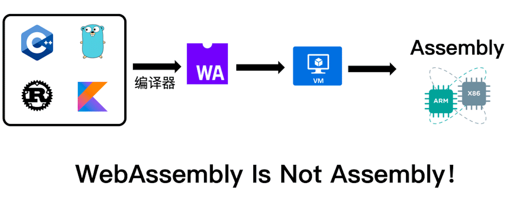
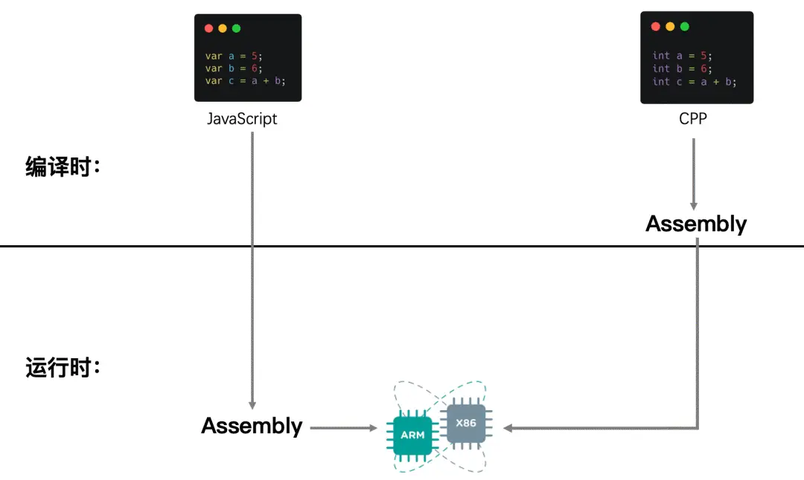

>WebAssembly，简称`Wasm`，是一个浏览器的低级语言; 

> 开发人员提供了除 JavaScript 之外的 Web 编译目标。它使网站代码可以在安全的沙盒环境中以接近本机的速度运行。它是根据（Chrome，Firefox，Safari 和 Edge）所代表的意见开发的。  

> [他们达成了设计共识,](https://webassembly.org/)这些浏览器现在都支持 WebAssembly。

> WebAssembly 以二进制格式交付，这意味着与 JavaScript 相比，WebAssembly 在大小和加载时间上都具有优势。但是它也有易于理解的[文本表示形式](https://developer.mozilla.org/zh-CN/docs/WebAssembly/Understanding_the_text_format)。
> 应用场景 
> - 游戏
> - CAD应用
> - 图像/视频编辑
> - [等等](https://webassembly.org/docs/use-cases/)

`C`,`C++`,`Rust`,`Go`,[`AssemblyScript`](https://www.assemblyscript.org/)等目前都支持编译至`Wasm`,*[MDN中记录C、Rust相关资料](https://developer.mozilla.org/zh-CN/docs/WebAssembly/C_to_Wasm)* 以及 [Wasm官网](https://webassembly.org/getting-started/developers-guide/)

> 关于面向 Web 的通用二进制和文本格式,就是一个可移植、体积小、加载快并且兼容 Web 的全新格式。

#### JS填坑史：(此处并不证明先后次序)
- **TypeScript**： JS虽然足够灵活，但在大型项目中容易出现`类型错误`等问题。
但 TS 的类型系统确实能够显著提高代码的可维护性，尤其是在`多人合作的项目`中，类型定义能够提供清晰的接口规范，减少沟通成本。
- **V8**: 带来即时编译(JIT)、垃圾回收机制。我们应该是还没见过V8前的js面貌。
- **单线程 -> 阻塞**: 先后又加入了WebWorker,以及上层建筑Virtual Dom
- **Asm.js**: 虽然有了JIT，但是在需要高性能的场景还是需要在进行优化。JS源动态编译类型、以及垃圾回收机制。为了避免这种，Asm.js 和 类型语言TS相似，**但是它的变量一律都是静态类型，并且取消垃圾回收机制**，除了这两点，它与 JavaScript 并无差异，也就是说，asm.js 是 JavaScript 的一个严格的子集。[asm最新版本官网JS](http://asmjs.org/spec/latest/#types) 以及 [Demo](./practice/asm/demo.js)
    >asm.js 和 AssemblyScript 都是为了让 Web 应用能够运行更高效的代码;   
    asm.js 的设计使得它可以在不支持 WebAssembly 的旧版浏览器上运行，因为它本质上仍然是 JavaScript。

#### Cases
1. Hello World *(C直接编译JS)*
    > `cd ./practice/hello && sh compile.sh`
2. asm 
    > `cd ./practice/asd/ && sh start.sh`
3. beginOpenGl *使用C++ 绘制一个 三角形*
    > `cd ./practice/beginOpenGl/ && sh start.sh`
4. OpenGl     * C++与JS 相互调用*
    > `cd ./practice/openGL/ && sh start.sh`
5. Fibonacci *耗时对比*
    > `cd ./practice/fib2/ && sh start.sh`
6. 可以再看下案例 wasm 的继承案例，[在UI里面](https://sparrowui.cn/components/drawer/) 点击代码运行

## 参考
[关于wasm的文件系统](https://www.cntofu.com/book/150/zh/ch3-runtime/ch3-03-fs.md)  
[C/C++面向WebAssembly编程 ](https://www.cntofu.com/book/150/index.html)  
[c++项目转成wasm全过程](https://zhuanlan.zhihu.com/p/158586853)  
[记一次完整 C++ 项目编译成 WebAssembly 的实践](https://zhuanlan.zhihu.com/p/258560278)  
[【编程知识】最干的c++(wasm)和js互调教程](https://zhuanlan.zhihu.com/p/655814356)  
[Three.js to WebAssembly with AssemblyScript
Resources](https://discourse.threejs.org/t/porting-three-js-to-webassembly-with-assemblyscript/11629/15)  
[The introductory guide to AssemblyScript](https://blog.logrocket.com/the-introductory-guide-to-assemblyscript/)
[AssemblyScript介绍中文](https://zhuanlan.zhihu.com/p/93203891)

## 其他
Q1: 如果`ThreeJS`加入`WebAssembly`是否会带来优化？  
Q2: [为什么有了asmjs还需要WebAssembly？](https://webassembly.org/docs/faq/)
Q3: Wasm 与 Canvas交互？
Q4: Wasm里的openGL真的调用了GPU吗？