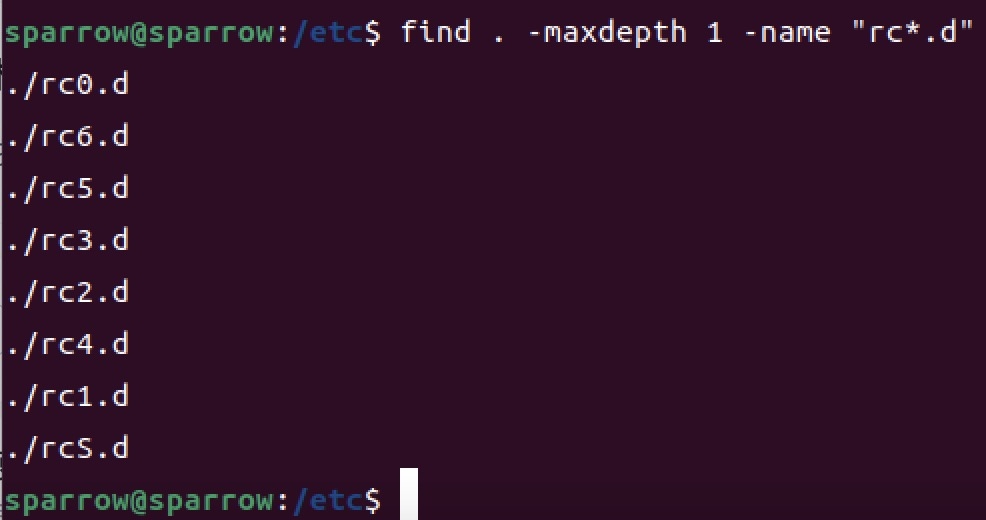

### 系统运行级别
> 所谓运行级别，简单点来说，就是指操作系统当前正在运行的功能级别。在我们使用的Linux系统中，一共定义了7种运行级别，从0到6，每一种运行级别都具有不同的功能

Linux下的**7种**运行级别

&emsp;**0 halt** 关机，代表系统停机状态，默认情况下，系统运行级别不能设置为0，否则电脑一开机就进入关机模式，电脑将不能正常启动  
&emsp;**1 Single user mode** 单用户模式，只支持root账户，主要用于系统维护，禁止远程登陆，类似于Windows下的安全模式  
&emsp;**2 Multiuser，without NFS** 它是多用户模式，没有网络文件系统支持  
&emsp;**3 Full Multiuser mode** 完全多用户模式，有网络文件系统，用户登录后进入控制台命令行模式，在没有网络的环境下等同于运行级别2  
&emsp;**4 unused** 系统未使用，用作保留，一般不用，在一些特殊情况下可以用它来做一些事情，例如：在笔记本电脑的电池用尽时，可以切换到这一模式来做一些设置  
&emsp;**5 X11** 图形界面的多用户模式用户登录后直接进入X-Window系统  
&emsp;**6 Reboot** 重启，默认情况下，运行级别不能设为6，否则电脑一开机就进入重启模式会一直不停地重启，系统将不能正常的启动  

这7种运行级别见，差别在于系统默认启动的服务不同。例如：运行级别3默认不启动X Window图形界面服务，而运行级别5却默认启动X Window。本质上他们是没有区别的，更无所谓不同级别间功能强弱的问题，用户完全可以自己定义，不同级别的默认服务。

另外，在任何运行级别下，用户都可以使用`init`命令，来切换到其他的运行级别。事实上，标准的Linux运行级别为3和5，如果是3的话，系统就在多用户状态；如果是5的话，则运行X Window系统。

不同的运行级别有不同的用处，我们可以根据不同情形来设置。例如：如果丢失了root账户的口令，那么可以让机器启动进入单用户模式，然后使用passwd命令来重置root的密码。

--- 

**运行级别的原理**
在目录`/etc/rc.d/init.d`下，有许多的服务器脚本程序，一般称为服务（`service`）；在`/etc/rc.d`下有7个名为`rcN.d`（**N的取值为0-6**）的目录，对应系统的7个运行级别；

`rcN.d`目录下都是一些符号链接文件，这些链接文件都指向`init.d`目录下的`service`脚本文件，这些链接文件的命名规则为`K+nn+服务名`或`S+nn+服务名`，其中`nn`为两位数字；


系统会根据指定的运行级别进入对应的rcN.d目录，并按照文件名顺序检索目录下的链接文件：对于以`K（Kill）`开头的文件，系统将终止对应的服务；对于以`S（Start）`开头的文件，系统将启动对应的服务。

与运行级别有关的命令有，查看运行级别：runlevel命令，它的结果是两个数字，先后显示系统上一次和当前的运行级别，如果不存在上一次运行级别则用大写的N表示。


> 如果需要更换系统运行级别，直接执行`init 数字`就可以；例如`init 5`这就是最开始的默认级别（ubuntu20.04）

进入其他的运行级别：init N（N的取值为0 1 2 3 4 5 6）
```shell
init 1 # 进入单用户模式
init 3 # 进入多用户模式
init 5 # 登录图形界面
init 0 # 系统关机
init 6 # 系统重启
```

那么在我们使用的CentOS 7或ubuntu的系统中，查看系统当前运行级别，还可以使用`systemctl get-default`

查看运行级别：`systemctl get-default`
设置系统开机时直接进入runlevel 3：`systemctl set-default multi-user.target`
设置系统开机时直接进入runlevel 5：`systemctl set-default graphical.target`


[系统命令](./service-cmd.md)
[systemctl](./service-systemctl.md)