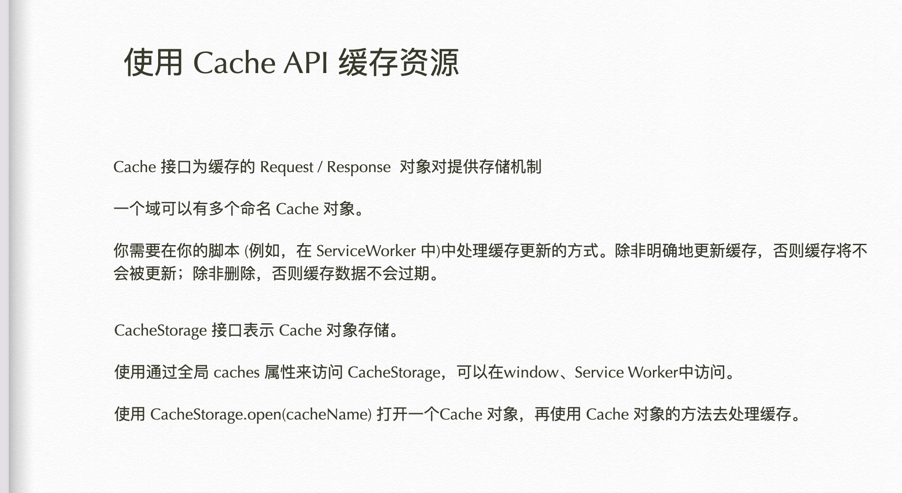
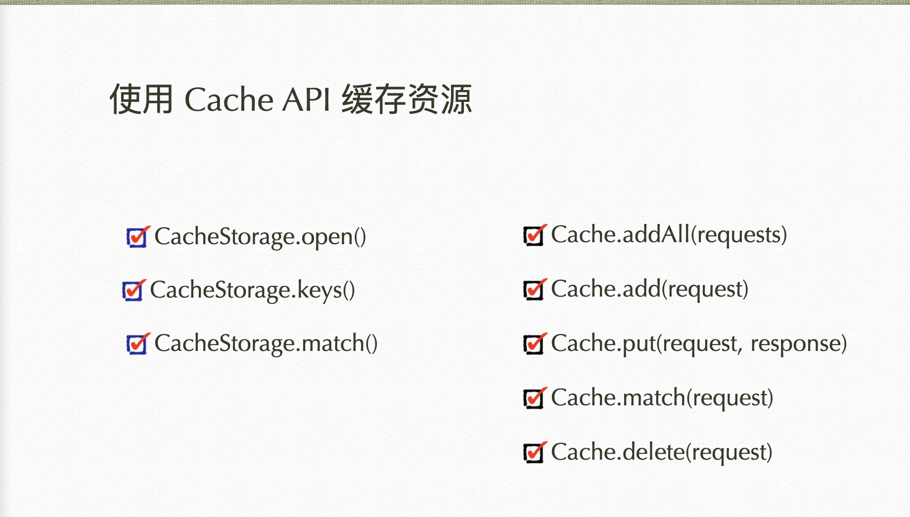

## Service Worker

>概念  
&emsp; ServiceWorker 一般作为 Web 应用程序、浏览器和网络之间的代理服务。他们旨在创建有效的离线体验，拦截网络请求，以及根据网络是否可用采取合适的行动，更新驻留在服务器上的资源。他们还将允许访问推送通知和后台同步 API。

### 前端缓存简介
1. http缓存   
   http缓存都是第二次请求时开始的，这也是个老生常谈的话题了。无非也是那几个http头的问题
   `Expires` 、 `Cache-Control` 、 `Last-Modified / If-Modified-Since` 、 `Etag / If-None-Match`
2. 浏览器缓存  
   storage
3. 前端数据库  
   前端数据库有WebSql和IndexDB，其中WebSql被规范废弃，他们都有大约磁盘的50%的最大容量，可以理解为localStorage的加强版。
4. 应用缓存
   Service Worker;本质上也是浏览器缓存资源用的，只不过他不仅仅是cache，也是通过worker的方式来进一步优化。他基于h5的web worker，所以绝对不会阻碍当前js线程的执行，sw最重要的工作原理就是
    1. 后台线程：独立于当前网页线程；
    2. 网络代理：在网页发起请求时代理，来缓存文件；

### 特点
- 必须是https 才能用！
- 无法直接访问 DOM ， 可通过 postMessage 发送消息与页面通信；
- 能够控制页面发送网络请求；
- 开发过程中可以通过 locakhost 使用 service worker。
ServiceWorker是Web Worker的一种
-  可以使用一些离线存储API —— CacheStorage 和 IndexedDB，不能访问localStorage


### 展示要点

1、浏览器能力检测和注册时机

```js
if ('serviceWorker' in navigator) {
  // Service Worker 是为了提升用户的首屏访问体验，所以在页面完全加载之后再进行 Service Worker 的注册，避免与页面内容抢占网络资源
  window.addEventListener('load', function () {
    // navigator.serviceWorker.register('service-worker.js', { scope: './' })
  }
}
```
2、注册 Service Worker
```js
if ('serviceWorker' in navigator) {
  navigator.serviceWorker.register('service-worker.js', {scope: './'})
  .then(function(registration) {
    document.querySelector('#status').textContent = 'succeeded';
  }).catch(function(error) {
    document.querySelector('#status').textContent = error;
  });
} else {
  // The current browser doesn't support service workers.
  let aElement = document.createElement('a');
  aElement.href = `
     http://www.chromium.org/blink/serviceworker/service-worker-faq
  `;
  aElement.textContent = 'unavailable';
  document.querySelector('#status').appendChild(aElement);
}
```
3、Service Worker 的监听事件，install activate
4、install 失败的一些情况 ——
* 没有使用HTTPS
* scope 指定的超过了限制
3、DevTools 里的 Service Worker
4、在 Chrome 中 跳转到 `chrome://inspect/#service-workers` 查看 Service Worker 是否已启用

### service worker的生命周期

- Service Worker 的生命周期和网页是相互独立的
- 在网页的 JS 代码中调用 Service Worker 的注册方法开始安装。在安装阶段可以进行一些缓存工作，缓存失败安装就会失败。如果安装成功，代表了缓存也成功完成了
- 安装成功后触发 activate 事件，Service Worker 处于激活状态
- 激活后的Service Worker线程可以控制页面、监听事件了，它可以根据情况被中止或者唤起

### service worker 支持的事件
- install 事件会在注册完成之后触发。install 事件一般是被用来填充你的浏览器的离线缓存能力。
- activate 事件在脚本激活后触发，一般在这里处理旧版本的缓存
- fetch 事件监听客户端的请求，包括任何被 service worker 控制的文档和文档内引用的资源。
配合 respondWith() 方法，可以劫持 HTTP 响应


### cache API



### CacheStorage

* Cache 缓存的是 Request / Response 键值对
* 打开缓存
* 添加缓存
* 通过 waitUntil 和 promise 确认缓存是否成功

### fetch，网络代理

* 监听 fetch 事件
* 通过 respondWith 拦截 HTTP 请求，这个方法接受一个 promise，通过返回一个 Response、network error 或者 Fetch的方式resolve。

### 可以体验一下 service worker 的更新操作

* 新的 SW 安装之后会进入等待状态，需要等待旧版本的 SW 废止后，新的 SW 才会激活
* 可以关闭所有的网页让旧版 SW 中止，之后浏览器会将 SW 替换为新版
* 或者打开 DevTools，开启 update on reload，然后刷新页面就可以了


### 通信
MessageChannel 为通信管道对象，使用 MessageChannel 构造函数将返回一个 MessageChannel 对象，返回的对象中包含两个 MessagePort 对象，可以实现双端通信。

```js
// 创建 MessageChannel 新实例对象
var channel = new MessageChannel();

// MessageChannel实例默认具有port1和port2两个对象属性
var port1 = channel.port1;
var port2 = channel.port2;

// MessageChannel实例onmessage事件可以实现监听并绑定回调函数
port1.onmessage = function(event) {
    console.log("port1收到来自port2的数据：" + event.data);
}
port2.onmessage = function(event) {
    console.log("port2收到来自port1的数据：" + event.data);
}

// MessageChannel实例postMessage方法可以触发onmessage事件
port1.postMessage("发送给port2");
port2.postMessage("发送给port1");

```

### orther 
1. 关于 https ssl 证书问题 （chrome）
   - mac 使用http-server https 服务
     1. `openssl req -newkey rsa:2048 -new -nodes -x509 -days 3650 -keyout key.pem -out cert.pem`
     2.  `sudo http-server -S -C cert.pem -o`
   - 证书无效  
      如果提示证书无效，请暴力解决 参考 [本地证书过期处理](https://blog.csdn.net/qq_42359718/article/details/109033560)
   - 如果出现 `An SSL certificate error occurred when fetching the script.`  
     请参考 [关于ssl：您可以使用带有自签名证书的服务人员吗？](https://www.codenong.com/38728176/)    
     MAC情况下： `/Applications/Google\ Chrome.app/Contents/MacOS/Google\ Chrome --user-data-dir=/tmp/foo --ignore-certificate-errors --unsafely-treat-insecure-origin-as-secure=https://127.0.0.1:8080`  通过命令行启动chrome
   - [http-server](https://github.com/http-party/http-server) 