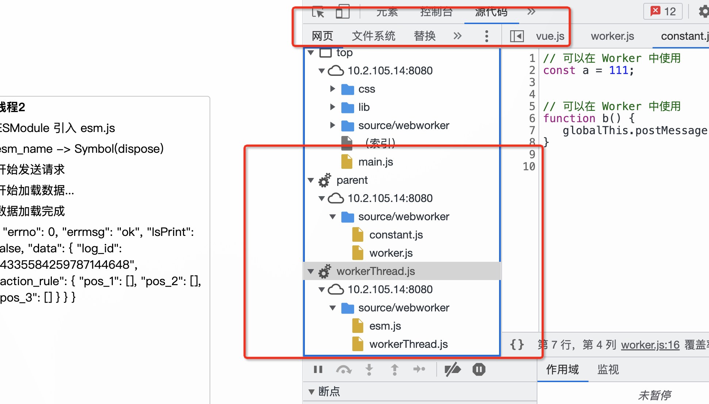

## web worker
### 特性
- JavaScript 是一个单线程的语言；
- 异步编程通过调度一部分代码在event loop中执行，从而让程序流畅地运行；
- Web Workers 是真正的多线程
- Service Worker 是 Web Worker 的一个子类

1. 创建 Worker 通过 new 的方式来生成一个实例，参数为 url 地址，该地址必须和其创建者是同源的。
    ```js
     const worker = new Worker('./worker.js'); // 参数是url，这个url必须与创建者同源 
    ```
2. Worker 的方法
   - onmessage 主线程中可以在 Worker 上添加 onmessage 方法，用于监听 Worker 的信息。
        ```js
        const worker = new Worker('./worker.js');
        worker.onmessage = function (messageEvent) {
                console.log(messageEvent)
        } 
        ```
   - onmessageerror 主线程中可以在 Worker 上添加 onmessageerror 方法，用于监听 Worker 的错误信息。
        ```js
        const worker = new Worker('./worker.js');
        worker.onmessageerror = function (messageEvent) {
            console.log(messageEvent)
        } 
        ```
   - postMessage() 主线程通过此方法给 Worker 发送消息，发送参数的格式不限（可以是数组、对象、字符串等），可以根据自己的业务选择。
        ```js
        const worker = new Worker('./worker.js');
        worker.postMessage({ type: 'start', payload: { count: 666 } }); // 发送信息给worker
        ```
   - terminate() 主线程通过此方法终止 Worker 的运行。
        ```js
        const worker = new Worker('./worker.js');
        worker.terminate();
        ```
3. 通信  
   Worker 的作用域跟主线程中的 Window 是相互独立的，并且 Worker 中是获取不到 DOM 元素的。所以在 Worker 中你无法使用 Window 变量。取而代之的是可以用 self 来表示全局对象。self 上有哪些方法和属性，感兴趣的小伙伴可以自行输出查看。比较常用的方法是 onmessage、postMessage，主要用来跟主线程进行通信。
4. Worker 中引用其他脚本的方式
   1. `importScripts`
      ```js
          /**  shared/20220805/source/webworker */
          importScripts('constant.js');
          b();


          /** constant.js */
          const a = 111;
          function b() {
               globalThis.postMessage('调用 constant 文件 ->> ' + arguments.callee.name + ' 函数');
          }

      ```
     2. ESM  
     所有的现代浏览器都支持通过 `<script type="module" src="a.js">` 来运行 JavaScript 模块。Firefox 之外的所有现代浏览器现在也都支持对应 Worker 的一种写法：`new Worker("./worker.js", {type: "module"}) 。`    
      ```js
          /** index.js */
          const thread2 = new Worker(worker2, {type: 'module'});
           
          /* worker2.js */
          import * as ESM from './esm.js';
          ESM.doRequest();
          

           /** esm.js */
          const esm_name = Symbol('dispose');

          const doRequest = () => {
          globalThis.postMessage("esm_name -> " + esm_name.toString());
          globalThis.postMessage("开始发送请求")
          baiduSearch().then(a => a.json())
          .then((data) => {
               globalThis.postMessage(data)
          })
          }
          function baiduSearch() {
          return fetch("https://ug.baidu.com/mcp/pc/pcsearch", {
          }
          export {
               esm_name,
               doRequest
          }
      ```
5. 调试
     
### 目前触及过的使用场景
- 渲染和计算的完全解耦,计算要合理的拆分到Worker中。
- 计算时间相对长，超出了帧预算，阻碍了渲染引擎。

### 参考 
1. [政采云前端团队 -- Web Worker](https://juejin.cn/post/7091068088975622175)
2. [Mdn - WebWorker](https://developer.mozilla.org/zh-CN/docs/Web/API/Web_Workers_API)
3. [部分阅读](http://www.proyy.com/6996893383310442504.html#toc_12)
4. [阮一峰](http://www.ruanyifeng.com/blog/2018/07/web-worker.html)

> 免责声明：综上不赋予任何文献参考价值，仅供内部借鉴。  
> 本文绝大部份参考于 **掘金社区**  **政采云前端团队** `Web Worker` 一文。 